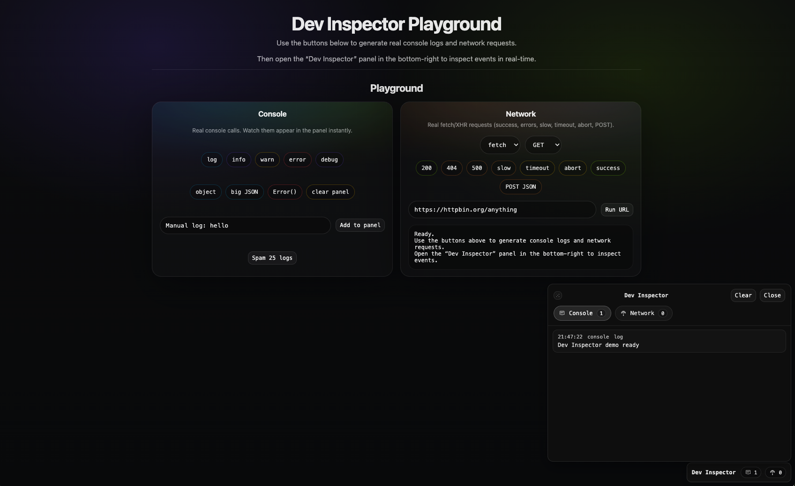

# Dev Inspector

[](https://www.npmjs.com/package/dev-inspector)
[](https://www.npmjs.com/package/dev-inspector)
[](./LICENSE)

In-page devtools-style logger panel for web apps. Capture **console** and **network** activity, store it in memory, and render it inside a lightweight UI panel.



## Links

- **Website / Live demo**: `https://dev-inspector.alibugatekin.com/`
- **npm**: `https://www.npmjs.com/package/dev-inspector`

## Features

- Console interception: `log/info/warn/error/debug`
- Network interception: `fetch` + `XMLHttpRequest`
- In-memory storage with events (`EventTarget`)
- UI panel with tabs (Console / Network), counters, severity/status colors, and resize
- Search across console messages and network requests (URL, method, status, body)
- Auto-scroll lock with a "Latest" jump button that surfaces unread entries
- Light / dark theme with `localStorage` persistence (defaults to light)
- Configurable panel title (used in the header and the floating toggle)
- Vite demo playground

## Installation

```bash
npm i dev-inspector
```

## Quick Start

```ts
import { initDevInspector } from "dev-inspector";

initDevInspector({
  maxSize: 500,
  networkOptions: { includeBodies: false },
  panelOptions: {
    initiallyOpen: true,
    title: "My App Inspector",
    theme: "light",
    persistTheme: true,
  },
});
```

### Panel options

| Option            | Type                | Default                 | Description                                                                          |
| ----------------- | ------------------- | ----------------------- | ------------------------------------------------------------------------------------ |
| `title`           | `string`            | `"Dev Inspector"`       | Label shown in the panel header **and** the floating toggle pill in the bottom-right |
| `initiallyOpen`   | `boolean`           | `true`                  | Open the panel on mount                                                              |
| `theme`           | `"light" \| "dark"` | `"light"`               | Initial theme. Overridden by a stored value when `persistTheme` is `true`            |
| `persistTheme`    | `boolean`           | `true`                  | Persist the user's theme choice in `localStorage`                                    |
| `themeStorageKey` | `string`            | `"dev-inspector:theme"` | Key used by `localStorage` to remember the theme                                     |

The theme can also be toggled at runtime via the sun/moon button in the panel header. When `persistTheme` is `true`, the choice is stored under `themeStorageKey` and restored on the next load.

## Important: Browser-only (SSR)

Dev Inspector’s UI (`createPanel()` and the default `initDevInspector()` flow) requires a **browser environment** (it needs `document`).

If your app uses **SSR** (Next.js, Remix, Nuxt, SvelteKit, etc.), do not call `initDevInspector()` at module scope on the server. Initialize it **client-side only** (e.g. in an effect, lifecycle hook, or a client-only component).

Example (client-only init with dynamic import):

```ts
async function initInBrowser() {
  if (typeof window === "undefined") return;
  const { initDevInspector } = await import("dev-inspector");
  initDevInspector({
    panelOptions: { initiallyOpen: true, title: "Dev Inspector" },
  });
}

initInBrowser();
```

## Demo (Local development)

```bash
npm install
npm run demo
```

The demo page includes interactive generators for console logs and network requests so you can verify the panel quickly.

## API

### `initDevInspector()`

One-call integration that installs console + network interception and renders the UI panel.

## Environment Notes

- `createPanel()` requires a browser-like environment (needs `document`).
- `installNetworkLogger()` only captures real browser `fetch` / `XMLHttpRequest` traffic.

## Contributing

See `CONTRIBUTING.md`.

## License

MIT (see `LICENSE`).
